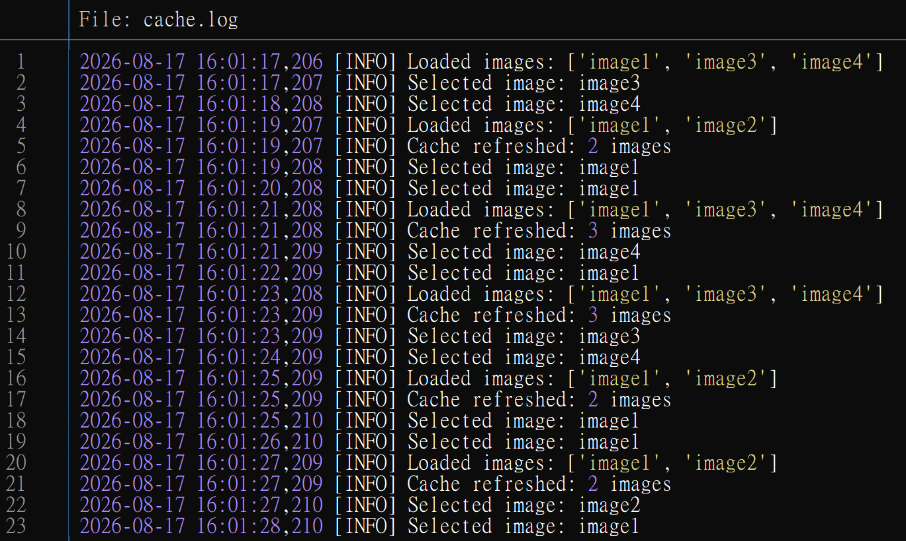

{fig-align="left" fig-alt="Python cache refresh and image selection logs."}

Today I learned that a Python thread can be used to periodically refresh a cache in a long-running worker.

For example, imagine a worker that needs to select an image every second from a source that isn't updated frequently. Instead of querying the source every time, the main thread can use a local cache for fast access, while a background thread periodically refreshes that cache.

Here's a self-contained example:
```python
import logging
import random
import threading
import time

IMAGE_REFRESH_INTERVAL = 2  # 2 seconds

logger = logging.getLogger(__name__)


def refresh_cache(images):
    """Periodically refresh the shared image cache."""
    while True:
        time.sleep(IMAGE_REFRESH_INTERVAL)

        new_images = load_images()

        # Update the existing list instead of rebinding `images`.
        # This keeps the same list object shared with `worker()`.
        images[:] = new_images

        logger.info("Cache refreshed: %d images", len(images))


def load_images():
    """Simulate loading images from an external source."""
    if random.choice((True, False)):
        images = ["image1", "image2"]
    else:
        images = ["image1", "image3", "image4"]

    logger.info("Loaded images: %s", images)

    return images


def draw(images):
    """Simulate selecting an image from the current cache."""
    image = random.choice(images)

    logger.info("Selected image: %s", image)


def worker():
    # Load the initial cache before starting the refresh thread.
    images = load_images()

    # The background thread periodically updates the same list object.
    threading.Thread(
        target=refresh_cache,
        args=(images,),
        daemon=True,
    ).start()

    # Continue using the shared cache while it is refreshed in the background.
    while True:
        draw(images)
        time.sleep(1)


if __name__ == "__main__":
    logging.basicConfig(
        level=logging.INFO,
        format="%(asctime)s [%(levelname)s] %(message)s",
    )

    worker()
```

The key part is:
```python
images[:] = new_images
```
This replaces the contents of the existing list rather than assigning a new list to the local `images` variable. Therefore, the main thread and the background thread continue to reference the same list object.

The `daemon=True` setting also makes the refresh thread a background thread that won't prevent the Python process from exiting when the main thread finishes.

One thing to keep in mind is thread safety. If the operations performed by multiple threads become more complex—for example, if multiple threads need to modify the cache or several pieces of shared state must be updated together—a `threading.Lock` may be necessary.

In this example, the main thread only reads the cache to select a random image, while the refresh thread replaces its contents periodically, so the simple approach is sufficient for this demonstration.


### A Rust Version
For comparison, I also asked AI to implement the same cache-refresh concept in Rust. The Rust version uses `Arc<Mutex<Vec<String>>>` to safely share the cache between the main thread and the background thread.

It provides a useful comparison with Python: `Arc` handles shared ownership between threads, while `Mutex` protects the shared cache from simultaneous access.

Here's the Rust version as a reference:
<details>
<summary>Show Rust version</summary>
```rust
use chrono::Local;
use rand::RngExt;
use std::sync::{Arc, Mutex};
use std::thread;
use std::time::Duration;

const IMAGE_REFRESH_INTERVAL: u64 = 2; // seconds

fn log(message: &str) {
    let now = Local::now();

    println!(
        "{},{:03} [INFO] {}",
        now.format("%Y-%m-%d %H:%M:%S"),
        now.timestamp_subsec_millis(),
        message
    );
}
/// Simulate loading images from an external source.
fn load_images() -> Vec<String> {
    let mut rng = rand::rng();

    let images = if rng.random_bool(0.5) {
        vec!["image1".to_string(), "image2".to_string()]
    } else {
        vec![
            "image1".to_string(),
            "image3".to_string(),
            "image4".to_string(),
        ]
    };

    log(&format!("Loaded images: {:?}", images));

    images
}

/// Periodically refresh the shared image cache.
///
/// This function runs forever in the background thread.
fn refresh_cache(images: Arc<Mutex<Vec<String>>>) {
    loop {
        thread::sleep(Duration::from_secs(IMAGE_REFRESH_INTERVAL));

        // Load the new data before acquiring the lock.
        //
        // This prevents the main thread from being blocked while
        // loading data from the external source.
        let new_images = load_images();

        // Lock the cache only when updating it.
        let mut cache = images.lock().unwrap();

        // Replace the contents of the existing Vec.
        //
        // This is conceptually similar to Python:
        //
        //     images[:] = new_images
        *cache = new_images;

        log(&format!("Cache refreshed: {} images", cache.len()));
    }
}

/// Select an image from the current cache.
fn draw(images: &Arc<Mutex<Vec<String>>>) {
    // Lock the cache while reading it.
    let cache = images.lock().unwrap();

    let mut rng = rand::rng();
    let index = rng.random_range(0..cache.len());

    log(&format!("Selected image: {}", cache[index]));

    // The MutexGuard is dropped here, releasing the lock.
}

fn worker() {
    // Load the initial cache before starting the background thread.
    let images = load_images();

    // Arc allows the cache to be shared between threads.
    // Mutex protects the Vec from simultaneous access.
    let images = Arc::new(Mutex::new(images));

    // Give the refresh thread another reference to the same cache.
    let refresh_images = Arc::clone(&images);

    // Start the background cache-refresh thread.
    thread::spawn(move || {
        refresh_cache(refresh_images);
    });

    // Continue selecting images while the background thread
    // refreshes the cache every two seconds.
    loop {
        draw(&images);
        thread::sleep(Duration::from_secs(1));
    }
}

fn main() {
    worker();
}
```
</details>

::: {.callout-warning}
# Disclaimer
This post was drafted by me, with AI assistance to refine the content.
::: 