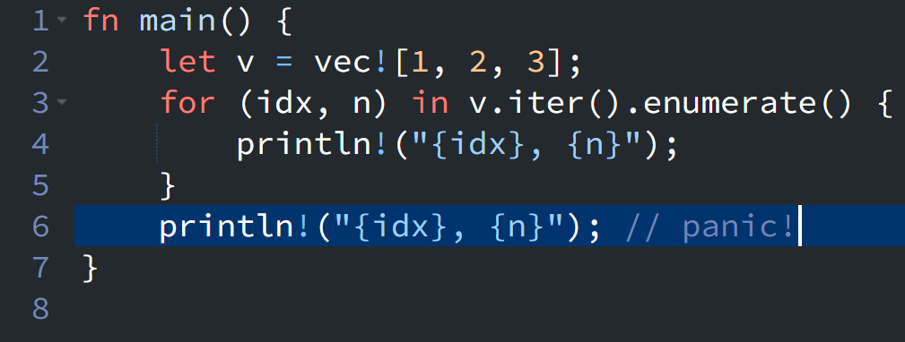

{fig-align="left" fig-alt="Rust Notes 1"}

For the last couple of months, I've been busy learning Rust and suddenly realized that I haven't written a blog post in a while. So I'd like to share an interesting pattern I encountered while learning Rust from the perspective of a Python developer.

In the following Rust code, I initially expected to see `idx=2` and `n=3`, but the compiler complained.
```rust
fn main() {
    let v = vec![1, 2, 3];
    for (idx, n) in v.iter().enumerate() {
        println!("{idx}, {n}");
    }
    println!("{idx}, {n}"); // panic!
}
```

What I had in mind was that the Rust code would translate conceptually into something like the following Python code:
```python
v = [1,2,3]
for idx, n in enumerate(v):
    print(f"{idx}, {n}")
print(f"{idx}, {n}") # 2, 3
```

Frankly speaking, I was puzzled for a while before realizing that `(idx, n)` in the Rust `for` loop is actually a pattern. The variables `idx` and `n` exist only within the scope of the loop body, so they are not available outside the `for` block.

Learning Rust keeps things refreshing and interesting every time I come across a pattern that differs from Python. I hope to continue sharing short Rust notes like this in the future.

::: {.callout-warning}
# Disclaimer
This post was drafted by me, with AI assistance to refine the content.
::: 