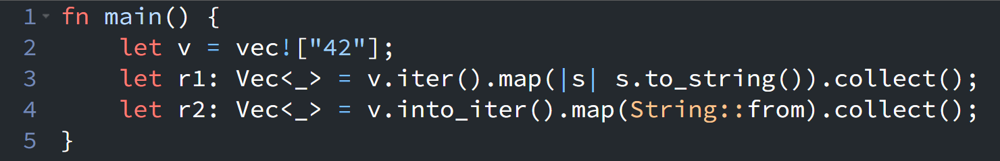

{fig-align="left" fig-alt="Rust Notes 2"}

Today I read some code in [Rust by Example](https://doc.rust-lang.org/rust-by-example/error/multiple_error_types/boxing_errors.html) and came across an interesting usage of iterator combinators.

Typically, I would pass a closure to `Iterator::map()`, but a more elegant approach is to use a trait function pointer directly. For example:

```rust
fn main() {
    let v = vec!["42"];
    let r1: Vec<_> = v.iter().map(|s| s.to_string()).collect();
    let r2: Vec<_> = v.into_iter().map(String::from).collect();
}
```

::: {.callout-tip collapse="true"}
## Alternative `r1` implementation using `String::from()`

An alternative implementation for `r1` is:
```rust
let r1: Vec<_> = v.iter().map(|&s| String::from(s)).collect();
```

Using `.to_string()` or `String::from()` here is mostly a matter of coding style.

The item type produced by `v.iter()` is `&&str`. In the first version, we rely on Rust’s auto-deref feature with `|s| s.to_string()`. In the second version, we manually destructure the extra reference layer using `|&s|`, converting the item from `&&str` to `&str`, which can then be passed directly to `String::from()`.
:::

For `r1`, we provide a closure that is applied to each item of the iterator. For `r2`, however, we directly pass the `String::from` function.

This technique becomes especially useful when type constraints are already clear from context. Instead of explicitly referring to a concrete constructor like `String::from`, Rust allows us to rely on more general trait-based conversions. For example, the book demonstrates that `.map_err(From::from)` leverages the `From::from` function as a generic conversion mechanism, letting the compiler infer the appropriate target error type from the surrounding `Result` context. This makes the code more flexible and reduces the need to commit to a specific concrete type at the point of transformation.


::: {.callout-warning}
# Disclaimer
This post was drafted by me, with AI assistance to refine the content.
::: 