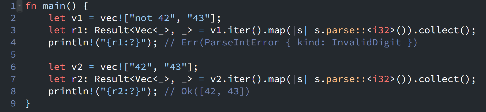

{fig-align="left" fig-alt="Rust Notes 3"}

Today, while reading the Rust documentation for the `Iterator` trait, I came across an interesting note in the [collect()](https://doc.rust-lang.org/std/iter/trait.Iterator.html#method.collect) method section.

It explains that `collect()` is more flexible than it might first appear:

> `collect()` can also create instances of types that are not typical collections. For example, a `String` can be built from `char`s, and an iterator of `Result<T, E>` items can be collected into `Result<Collection<T>, E>`. 

This behavior is particularly useful when you want either:

* to short-circuit immediately when the first error occurs, or
* all operations to succeed and collect the results.

For example:

```rust
fn main() {
    let v1 = vec!["not 42", "43"];
    let r1: Result<Vec<_>, _> = v1.iter().map(|s| s.parse::<i32>()).collect();
    println!("{r1:?}"); // Err(ParseIntError { kind: InvalidDigit })

    let v2 = vec!["42", "43"];
    let r2: Result<Vec<_>, _> = v2.iter().map(|s| s.parse::<i32>()).collect();
    println!("{r2:?}"); // Ok([42, 43])
}
```

In `r1`, the string `"not 42"` fails to parse as an `i32`, so the entire computation short-circuits and returns the first error (`ParseIntError`). The subsequent value `"43"` is never processed.

In contrast, `r2` contains only valid numeric strings, so all elements are successfully parsed and collected into a `Vec<i32>` wrapped in `Ok`.

::: {.callout-warning}
# Disclaimer
This post was drafted by me, with AI assistance to refine the content.
::: 