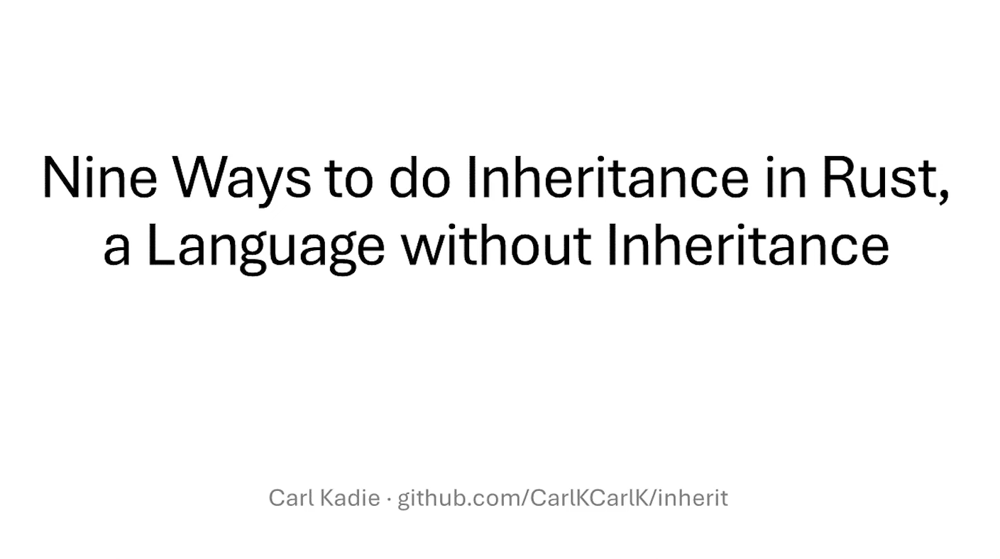

{fig-align="left" fig-alt="Rust Notes 4"}

After watching Carl Kadie’s excellent talk [Nine Ways to do Inheritance in Rust, a Language without Inheritance](https://www.youtube.com/watch?v=3IyKC5EtNkM), I decided to write down some notes from his work.

To be clear, all of the ideas and code presented here come from Carl Kadie. You can find the original material in the accompanying [GitHub repository](https://github.com/CarlKCarlK/inherit). My role here is simply that of a note-taker, with added commentary to help my future self (and perhaps others) revisit these concepts more easily.

## Puzzle 1: Trait Default Methods

`RangeSetBlaze` works with sets of integers such as `u8`, `i16`, and other integer types. Each integer type must provide fundamental operations like `min_value()` and `max_value()`. At the same time, we want all integer types to share additional behavior, such as an `exhausted_range()` method.

```{mermaid}
classDiagram
    direction TB

    class Integer {
        <<abstract class>>
        +min_value() Self // required
        +max_value() Self // required
        +exhausted_range() RangeInclusive~Self~  // code
    }

    class u8 {
        <<concrete class>>
        +min_value() Self
        +max_value() Self
        +exhausted_range() RangeInclusive~Self~  // inherited
    }

    class i16 {
        <<concrete class>>
        +min_value() Self
        +max_value() Self
        +exhausted_range() RangeInclusive~Self~  // inherited
    }

    Integer <|-- u8 : is-a
    Integer <|-- i16 : is-a
```
In Rust, traits are often thought of as contracts: they define a set of required methods that implementors must provide. In that sense, a trait specifies *what* functionality a type must have.

However, traits can do more than define interfaces. They can also provide concrete method implementations. When a trait includes such methods, all implementors automatically gain access to them unless they choose to override the default behavior. This gives us something conceptually similar to inheritance: shared behavior defined once and reused across multiple types.

This pattern is known as **trait default methods**.

::: {.callout-tip collapse="true"}
## Trait Default Methods — Code

```rust
use std::ops::RangeInclusive;

// TECHNIQUE NAME: Trait Default Methods.
trait Integer: Copy + Ord {
    fn min_value() -> Self;
    fn max_value() -> Self;

    // Default behavior inherited by implementors.
    // Any impl can override this method.

    /// Returns an exhausted (empty) range`.
    fn exhausted_range() -> RangeInclusive<Self> {
        debug_assert!(Self::min_value() < Self::max_value(), "Precondition");
        Self::max_value()..=Self::min_value()
    }
}

impl Integer for u8 {
    fn min_value() -> Self {
        u8::MIN
    }

    fn max_value() -> Self {
        u8::MAX
    }
}

impl Integer for i16 {
    fn min_value() -> Self {
        i16::MIN
    }

    fn max_value() -> Self {
        i16::MAX
    }
}

fn main() {
    let r1 = u8::exhausted_range();
    let r2 = i16::exhausted_range();

    assert_eq!(r1, 255..=0);
    assert!(r2.is_empty());
}

// TECHNIQUE NAME (again): Trait Default Methods.
```
:::

The key idea is that `u8` and `i16` only need to implement the required methods, `min_value()` and `max_value()`. The `exhausted_range()` method is defined once in the trait and automatically shared by all implementors.

This is not inheritance in the classical object-oriented sense, but it achieves one of the most practical benefits of inheritance: reuse of behavior without duplicating code.


::: {.callout-warning}
# Disclaimer
This post was drafted by me, with AI assistance to refine the content.
::: 