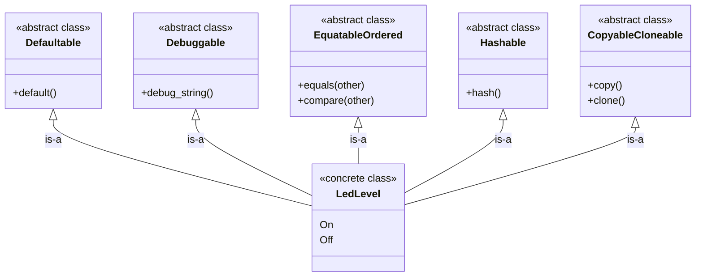

{fig-align="left" fig-alt="Rust Notes 4"}

After watching Carl Kadie’s excellent talk [Nine Ways to do Inheritance in Rust, a Language without Inheritance](https://www.youtube.com/watch?v=3IyKC5EtNkM), I decided to write down some notes from his work.

To be clear, all of the ideas and code presented here come from Carl Kadie. You can find the original material in the accompanying [GitHub repository](https://github.com/CarlKCarlK/inherit). My role here is simply that of a note-taker, with added commentary to help my future self (and perhaps others) revisit these concepts more easily.


## Puzzle 1: Trait Default Methods

`RangeSetBlaze` works with sets of integers such as `u8`, `i16`, and other integer types. Each integer type must provide fundamental operations like `min_value()` and `max_value()`. At the same time, we want all integer types to share additional behavior, such as an `exhausted_range()` method.

```{mermaid}
classDiagram
    direction TB

    class Integer {
        <<abstract class>>
        +min_value() Self // required
        +max_value() Self // required
        +exhausted_range() RangeInclusive~Self~  // code
    }

    class u8 {
        <<concrete class>>
        +min_value() Self
        +max_value() Self
        +exhausted_range() RangeInclusive~Self~  // inherited
    }

    class i16 {
        <<concrete class>>
        +min_value() Self
        +max_value() Self
        +exhausted_range() RangeInclusive~Self~  // inherited
    }

    Integer <|-- u8 : is-a
    Integer <|-- i16 : is-a
```
In Rust, traits are often thought of as contracts: they define a set of required methods that implementors must provide. In that sense, a trait specifies *what* functionality a type must have.

However, traits can do more than define interfaces. They can also provide concrete method implementations. When a trait includes such methods, all implementors automatically gain access to them unless they choose to override the default behavior. This gives us something conceptually similar to inheritance: shared behavior defined once and reused across multiple types.

::: {.callout-tip collapse="true"}
## Trait Default Methods — Code

```rust
use std::ops::RangeInclusive;

// TECHNIQUE NAME: Trait Default Methods.
trait Integer: Copy + Ord {
    fn min_value() -> Self;
    fn max_value() -> Self;

    // Default behavior inherited by implementors.
    // Any impl can override this method.

    /// Returns an exhausted (empty) range`.
    fn exhausted_range() -> RangeInclusive<Self> {
        debug_assert!(Self::min_value() < Self::max_value(), "Precondition");
        Self::max_value()..=Self::min_value()
    }
}

impl Integer for u8 {
    fn min_value() -> Self {
        u8::MIN
    }

    fn max_value() -> Self {
        u8::MAX
    }
}

impl Integer for i16 {
    fn min_value() -> Self {
        i16::MIN
    }

    fn max_value() -> Self {
        i16::MAX
    }
}

fn main() {
    let r1 = u8::exhausted_range();
    let r2 = i16::exhausted_range();

    assert_eq!(r1, 255..=0);
    assert!(r2.is_empty());
}

// TECHNIQUE NAME (again): Trait Default Methods.
```
:::

> The key idea is that `u8` and `i16` only need to implement the required methods, `min_value()` and `max_value()`. The `exhausted_range()` method is defined once in the trait and automatically shared by all implementors.

## Puzzle 2: Supertraits

A servo is an electric motor that can move to a specified angle. We want a `ServoEsp` (our type that controls a servo on an ESP32 microcontroller) to work with any code that needs a servo. A `ServoPlayerEsp` is similar, but with animation ability. (Inspired by `device-envoy`.)


```{mermaid}
classDiagram
    direction TB

    class Servo {
        <<abstract class>>
        +set_degrees(degrees)
    }

    class ServoPlayer {
        <<abstract class>>
        +set_degrees(degrees) // from Servo
        +animate(steps)
    }

    class ServoEsp {
        <<concrete class>>
        +set_degrees(degrees)
    }

    class ServoPlayerEsp {
        <<concrete class>>
        +set_degrees(degrees)
        +animate(steps)
    }

    Servo <|-- ServoPlayer : is-a
    Servo <|-- ServoEsp : is-a
    ServoPlayer <|-- ServoPlayerEsp : is-a
```

In Rust, a trait can depend on another trait. The syntax `trait B: A` means that `B` requires `A` as a prerequisite. In other words, any type that implements `B` must also implement `A`.

This is similar to saying that `B` extends `A`: anything that works with `A` will also work with `B`, but `B` provides additional functionality on top.

In traditional object-oriented terms, this feels like an "is-a" relationship where `B` can do everything `A` can do, plus more, while still being treated as an `A` when needed.

::: {.callout-tip collapse="true"}
## Supertraits — Code

```rust
use std::thread;
use std::time::Duration;

// `Servo` is an abstract class (a trait), not a concrete driver.
trait Servo {
    fn set_degrees(&self, degrees: u16);
}

// `ServoPlayer` is also abstract. It extends `Servo` (supertrait), so any
// `ServoPlayer` can do everything in `Servo` plus animation.
// TECHNIQUE NAME: Supertraits
trait ServoPlayer: Servo {
    // (degrees, milliseconds to hold at that angle)
    fn animate(&self, steps: &[(u16, u64)]);
}

#[derive(Default)]
// Concrete servo driver (similar naming to the real example): `ServoEsp`.
struct ServoEsp;

impl Servo for ServoEsp {
    fn set_degrees(&self, degrees: u16) {
        println!("[ServoEsp] set angle -> {degrees}°");
    }
}

#[derive(Default)]
// Concrete servo player driver that can animate.
struct ServoPlayerEsp;

impl Servo for ServoPlayerEsp {
    fn set_degrees(&self, degrees: u16) {
        println!("[ServoPlayerEsp] set angle -> {degrees}°");
    }
}

impl ServoPlayer for ServoPlayerEsp {
    fn animate(&self, steps: &[(u16, u64)]) {
        for (degrees, ms) in steps {
            self.set_degrees(*degrees);
            println!("[ServoPlayerEsp] hold for {ms}ms");
            thread::sleep(Duration::from_millis(*ms));
        }
    }
}

// Generic program that only needs a `Servo`.
fn center_servo(servo: &impl Servo) {
    servo.set_degrees(90);
}

// Generic program that needs a `ServoPlayer`.
fn run_wave(player: &impl ServoPlayer) {
    player.animate(&[
        (0, 120),
        (45, 100),
        (90, 100),
        (135, 100),
        (180, 120),
        (135, 100),
        (90, 100),
        (45, 100),
        (0, 120),
    ]);
}

fn main() {
    let servo_esp = ServoEsp::default();
    let servo_player_esp = ServoPlayerEsp::default();

    center_servo(&servo_esp);
    // `ServoPlayer` can do everything `Servo` can!
    center_servo(&servo_player_esp);
    // and more.
    run_wave(&servo_player_esp);
}
```
:::

> The key idea is that `ServoPlayer` builds on top of `Servo` rather than replacing it. Any type that implements `ServoPlayer` must also implement `Servo`, allowing it to be used wherever a `Servo` is expected while providing additional capabilities. Supertraits therefore offer a trait-based way to express "is-a" relationships and extend behavior incrementally.


## Puzzle 3: Extension Traits

We want to add a new method `is_odd()` to an existing concrete type `usize`, that type is defined outside our crate ("foreign").

```{mermaid}
classDiagram
    direction TB

    class UsizeExtensions {
        <<abstract class>>
        +is_odd() bool
    }

    class usize {
        <<concrete class>>
        +is_odd() bool // inherited
    }

    UsizeExtensions <|-- usize : is-a
```

For types that we define ourselves, such as structs and enums, we can add methods through an `impl` block. However, Rust does not allow us to write an inherent `impl` for a type defined in another crate, including primitive types like `usize`.

This restriction prevents different crates from attaching conflicting methods to the same type, which would make method resolution ambiguous.

Fortunately, traits provide a workaround. We can define our own trait, implement it for the foreign type, and thereby extend the type with new methods. From the caller's perspective, these methods behave much like native methods on the type itself.

This pattern is known as **extension traits**.

::: {.callout-tip collapse="true"}
## Extension Traits — Code

```rust
// impl usize {
//     fn is_odd(self) -> bool {
//         self & 1 != 0
//     }
// }
// error[E0390]: cannot define inherent `impl` for primitive types

trait UsizeExtensions {
    fn is_odd(self) -> bool;
}

impl UsizeExtensions for usize {
    fn is_odd(self) -> bool {
        self & 1 != 0
    }
}

// TECHNIQUE NAME: extension traits.

fn main() {
    let count: usize = 7;

    assert!(count.is_odd());
    assert!(!12.is_odd());
}
```
:::

> The key idea is that `usize` "inherits" the `is_odd()` method from `UsizeExtensions`. Although we cannot add methods directly to the foreign type, implementing an extension trait gives us a very similar result from the caller's perspective.


## Puzzle 4: Derive-Generated Implementation

We want a small `LedLevel` enum type with two values (`On`, `Off`) that automatically participates in common behaviors (default value, debugging output, equality/order comparisons, hashing, copy/clone).



In Rust, the `derive` macro is a powerful convenience feature. It allows us to automatically generate implementations for many common traits, saving us from writing repetitive boilerplate code. These derived traits often provide essential functionality such as formatting, comparison, hashing, and cloning.

Beyond the standard library, many third-party crates also extend this idea. Libraries like `serde`, for example, provide `derive` support for serialization and deserialization traits, making it easy to integrate types with external systems.

::: {.callout-tip collapse="true"}
## Derive-Generated Implementation — Code

```rust
// TECHNIQUE NAME: derive-generated implementation

#[derive(Clone, Copy, Debug, Eq, Hash, Ord, PartialEq, PartialOrd, Default)]
enum LedLevel {
    On,
    #[default]
    Off,
}

fn main() {
    let default_level = LedLevel::default();
    let on = LedLevel::On;
    let off = LedLevel::Off;

    assert_eq!(default_level, LedLevel::Off);
    assert_ne!(on, off);
    assert!(off > on);

    // `Copy` + `Clone` come from derive too.
    let copied = on;
    let cloned = off.clone();
    assert_eq!(copied, on);
    assert_eq!(cloned, off);
}
```
:::

> The key idea is that a tiny enum like `LedLevel` can immediately behave like a fully featured type—supporting comparison, copying, hashing, and defaults—simply by attaching `#[derive(...)]`, without writing any manual implementation code.


## Conclusion
Here is the conclusion table from Carl Kadie:

{fig-align="left" fig-alt="Conclusion"}

::: {.callout-warning}
# Disclaimer
This post was drafted by me, with AI assistance to refine the content.
::: 