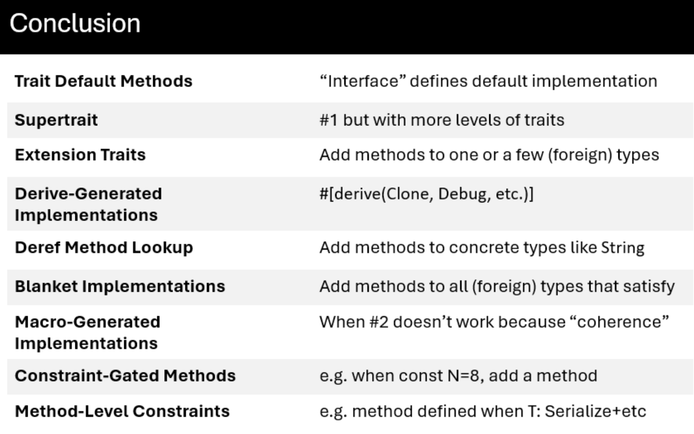

{fig-align="left" fig-alt="Rust Notes 4"}

After watching Carl Kadie’s excellent talk [Nine Ways to do Inheritance in Rust, a Language without Inheritance](https://www.youtube.com/watch?v=3IyKC5EtNkM), I decided to write down some notes from his work.

To be clear, all of the ideas and code presented here come from Carl Kadie. You can find the original material in the accompanying [GitHub repository](https://github.com/CarlKCarlK/inherit). My role here is simply that of a note-taker, with added commentary to help my future self (and perhaps others) revisit these concepts more easily.


## Puzzle 1: Trait Default Methods

`RangeSetBlaze` works with sets of integers such as `u8`, `i16`, and other integer types. Each integer type must provide fundamental operations like `min_value()` and `max_value()`. At the same time, we want all integer types to share additional behavior, such as an `exhausted_range()` method.

```{mermaid}
classDiagram
    direction TB

    class Integer {
        <<abstract class>>
        +min_value() Self // required
        +max_value() Self // required
        +exhausted_range() RangeInclusive~Self~  // code
    }

    class u8 {
        <<concrete class>>
        +min_value() Self
        +max_value() Self
        +exhausted_range() RangeInclusive~Self~  // inherited
    }

    class i16 {
        <<concrete class>>
        +min_value() Self
        +max_value() Self
        +exhausted_range() RangeInclusive~Self~  // inherited
    }

    Integer <|-- u8 : is-a
    Integer <|-- i16 : is-a
```
In Rust, traits are often thought of as contracts: they define a set of required methods that implementors must provide. In that sense, a trait specifies *what* functionality a type must have.

However, traits can do more than define interfaces. They can also provide concrete method implementations. When a trait includes such methods, all implementors automatically gain access to them unless they choose to override the default behavior. This gives us something conceptually similar to inheritance: shared behavior defined once and reused across multiple types.

::: {.callout-tip collapse="true"}
## Trait Default Methods — Code

```rust
use std::ops::RangeInclusive;

// TECHNIQUE NAME: Trait Default Methods.
trait Integer: Copy + Ord {
    fn min_value() -> Self;
    fn max_value() -> Self;

    // Default behavior inherited by implementors.
    // Any impl can override this method.

    /// Returns an exhausted (empty) range`.
    fn exhausted_range() -> RangeInclusive<Self> {
        debug_assert!(Self::min_value() < Self::max_value(), "Precondition");
        Self::max_value()..=Self::min_value()
    }
}

impl Integer for u8 {
    fn min_value() -> Self {
        u8::MIN
    }

    fn max_value() -> Self {
        u8::MAX
    }
}

impl Integer for i16 {
    fn min_value() -> Self {
        i16::MIN
    }

    fn max_value() -> Self {
        i16::MAX
    }
}

fn main() {
    let r1 = u8::exhausted_range();
    let r2 = i16::exhausted_range();

    assert_eq!(r1, 255..=0);
    assert!(r2.is_empty());
}

// TECHNIQUE NAME (again): Trait Default Methods.
```
:::

> The key idea is that `u8` and `i16` only need to implement the required methods, `min_value()` and `max_value()`. The `exhausted_range()` method is defined once in the trait and automatically shared by all implementors.

## Puzzle 2: Supertrait

A servo is an electric motor that can move to a specified angle. We want a `ServoEsp` (our type that controls a servo on an ESP32 microcontroller) to work with any code that needs a servo. A `ServoPlayerEsp` is similar, but with animation ability. (Inspired by `device-envoy`.)


```{mermaid}
classDiagram
    direction TB

    class Servo {
        <<abstract class>>
        +set_degrees(degrees)
    }

    class ServoPlayer {
        <<abstract class>>
        +set_degrees(degrees) // from Servo
        +animate(steps)
    }

    class ServoEsp {
        <<concrete class>>
        +set_degrees(degrees)
    }

    class ServoPlayerEsp {
        <<concrete class>>
        +set_degrees(degrees)
        +animate(steps)
    }

    Servo <|-- ServoPlayer : is-a
    Servo <|-- ServoEsp : is-a
    ServoPlayer <|-- ServoPlayerEsp : is-a
```

In Rust, a trait can depend on another trait. The syntax `trait B: A` means that `B` requires `A` as a prerequisite. In other words, any type that implements `B` must also implement `A`.

This is similar to saying that `B` extends `A`: anything that works with `A` will also work with `B`, but `B` provides additional functionality on top.

In traditional object-oriented terms, this feels like an "is-a" relationship where `B` can do everything `A` can do, plus more, while still being treated as an `A` when needed.

::: {.callout-tip collapse="true"}
## Supertrait — Code

```rust
use std::thread;
use std::time::Duration;

// `Servo` is an abstract class (a trait), not a concrete driver.
trait Servo {
    fn set_degrees(&self, degrees: u16);
}

// `ServoPlayer` is also abstract. It extends `Servo` (supertrait), so any
// `ServoPlayer` can do everything in `Servo` plus animation.
// TECHNIQUE NAME: Supertraits
trait ServoPlayer: Servo {
    // (degrees, milliseconds to hold at that angle)
    fn animate(&self, steps: &[(u16, u64)]);
}

#[derive(Default)]
// Concrete servo driver (similar naming to the real example): `ServoEsp`.
struct ServoEsp;

impl Servo for ServoEsp {
    fn set_degrees(&self, degrees: u16) {
        println!("[ServoEsp] set angle -> {degrees}°");
    }
}

#[derive(Default)]
// Concrete servo player driver that can animate.
struct ServoPlayerEsp;

impl Servo for ServoPlayerEsp {
    fn set_degrees(&self, degrees: u16) {
        println!("[ServoPlayerEsp] set angle -> {degrees}°");
    }
}

impl ServoPlayer for ServoPlayerEsp {
    fn animate(&self, steps: &[(u16, u64)]) {
        for (degrees, ms) in steps {
            self.set_degrees(*degrees);
            println!("[ServoPlayerEsp] hold for {ms}ms");
            thread::sleep(Duration::from_millis(*ms));
        }
    }
}

// Generic program that only needs a `Servo`.
fn center_servo(servo: &impl Servo) {
    servo.set_degrees(90);
}

// Generic program that needs a `ServoPlayer`.
fn run_wave(player: &impl ServoPlayer) {
    player.animate(&[
        (0, 120),
        (45, 100),
        (90, 100),
        (135, 100),
        (180, 120),
        (135, 100),
        (90, 100),
        (45, 100),
        (0, 120),
    ]);
}

fn main() {
    let servo_esp = ServoEsp::default();
    let servo_player_esp = ServoPlayerEsp::default();

    center_servo(&servo_esp);
    // `ServoPlayer` can do everything `Servo` can!
    center_servo(&servo_player_esp);
    // and more.
    run_wave(&servo_player_esp);
}
```
:::

> The key idea is that `ServoPlayer` builds on top of `Servo` rather than replacing it. Any type that implements `ServoPlayer` must also implement `Servo`, allowing it to be used wherever a `Servo` is expected while providing additional capabilities. Supertraits therefore offer a trait-based way to express "is-a" relationships and extend behavior incrementally.


## Puzzle 3: Extension Traits

We want to add a new method `is_odd()` to an existing concrete type `usize`, that type is defined outside our crate ("foreign").

```{mermaid}
classDiagram
    direction TB

    class UsizeExtensions {
        <<abstract class>>
        +is_odd() bool
    }

    class usize {
        <<concrete class>>
        +is_odd() bool // inherited
    }

    UsizeExtensions <|-- usize : is-a
```

For types that we define ourselves, such as structs and enums, we can add methods through an `impl` block. However, Rust does not allow us to write an inherent `impl` for a type defined in another crate, including primitive types like `usize`.

This restriction prevents different crates from attaching conflicting methods to the same type, which would make method resolution ambiguous.

Fortunately, traits provide a workaround. We can define our own trait, implement it for the foreign type, and thereby extend the type with new methods. From the caller's perspective, these methods behave much like native methods on the type itself.

This pattern is known as **extension traits**.

::: {.callout-tip collapse="true"}
## Extension Traits — Code

```rust
// impl usize {
//     fn is_odd(self) -> bool {
//         self & 1 != 0
//     }
// }
// error[E0390]: cannot define inherent `impl` for primitive types

trait UsizeExtensions {
    fn is_odd(self) -> bool;
}

impl UsizeExtensions for usize {
    fn is_odd(self) -> bool {
        self & 1 != 0
    }
}

// TECHNIQUE NAME: extension traits.

fn main() {
    let count: usize = 7;

    assert!(count.is_odd());
    assert!(!12.is_odd());
}
```
:::

> The key idea is that `usize` "inherits" the `is_odd()` method from `UsizeExtensions`. Although we cannot add methods directly to the foreign type, implementing an extension trait gives us a very similar result from the caller's perspective.


## Puzzle 4: Derive-Generated Implementations

We want a small `LedLevel` enum type with two values (`On`, `Off`) that automatically participates in common behaviors (default value, debugging output, equality/order comparisons, hashing, copy/clone).

```{mermaid}
classDiagram
    direction TB

    class LedLevel {
        <<concrete class>>
        On
        Off
    }

    class Defaultable {
        <<abstract class>>
        +default()
    }

    class Debuggable {
        <<abstract class>>
        +debug_string()
    }

    class EquatableOrdered {
        <<abstract class>>
        +equals(other)
        +compare(other)
    }

    class Hashable {
        <<abstract class>>
        +hash()
    }

    class CopyableCloneable {
        <<abstract class>>
        +copy()
        +clone()
    }

    Defaultable <|-- LedLevel : is-a
    Debuggable <|-- LedLevel : is-a
    EquatableOrdered <|-- LedLevel : is-a
    Hashable <|-- LedLevel : is-a
    CopyableCloneable <|-- LedLevel : is-a
```

In Rust, the `derive` macro is a powerful convenience feature. It allows us to automatically generate implementations for many common traits, saving us from writing repetitive boilerplate code. These derived traits often provide essential functionality such as formatting, comparison, hashing, and cloning.

Beyond the standard library, many third-party crates also extend this idea. Libraries like `serde`, for example, provide `derive` support for serialization and deserialization traits, making it easy to integrate types with external systems.

::: {.callout-tip collapse="true"}
## Derive-Generated Implementations — Code

```rust
// TECHNIQUE NAME: derive-generated implementation

#[derive(Clone, Copy, Debug, Eq, Hash, Ord, PartialEq, PartialOrd, Default)]
enum LedLevel {
    On,
    #[default]
    Off,
}

fn main() {
    let default_level = LedLevel::default();
    let on = LedLevel::On;
    let off = LedLevel::Off;

    assert_eq!(default_level, LedLevel::Off);
    assert_ne!(on, off);
    assert!(off > on);

    // `Copy` + `Clone` come from derive too.
    let copied = on;
    let cloned = off.clone();
    assert_eq!(copied, on);
    assert_eq!(cloned, off);
}
```
:::

> The key idea is that a tiny enum like `LedLevel` can immediately behave like a fully featured type—supporting comparison, copying, hashing, and defaults—simply by attaching `#[derive(...)]`, without writing any manual implementation code.


## Puzzle 5: Deref Method Lookup

We want an `HtmlBuffer` to feel like a string for everyday method calls, while still being its own distinct type. Note that `String` is a concrete type with storage, not just an interface/trait/abstract class.

```{mermaid}
classDiagram
    direction TB

    class String {
        <<concrete class>>
        -bytes
        +push_str()
        +len()
        +as_bytes()
    }

    class HtmlBuffer {
        <<concrete class>>
        +new()
        +push_str() // inherited
        +len() // inherited
        +as_bytes() // inherited
    }

    String <|-- HtmlBuffer : is-a
```

The `Deref` trait allows a type to specify what it should dereference into. This enables a powerful feature in Rust: **method lookup through deref coercion**.

When a method is not found on the original type, Rust will automatically try to dereference the value and search again on the target type. This process can repeat multiple times, meaning deref behavior can be **chained across multiple wrapper types**.

For example, a value like `Box<String>` does not implement `contains()` directly. However, Rust will first dereference the `Box<String>` into `String`, and then continue method lookup on `String`. Since `String` itself derefs into `str`, the call can continue one more step until `contains()` is found. As a result, a method call like the following works even though `contains` is defined on `str`:

```rust
fn main() {
    let s = Box::new(String::from("hello world"));
    assert!(s.contains("world"));
}
```

::: {.callout-tip collapse="true"}
## Deref Method Lookup — Code
```rust
// struct HtmlBuffer;
// impl String for HtmlBuffer {
// }
// Error because String is not a trait.

use std::ops::{Deref, DerefMut};

// HtmlBuffer 'wraps' a String
struct HtmlBuffer(String);

impl HtmlBuffer {
    fn new() -> Self {
        Self(String::new())
    }
}

impl Deref for HtmlBuffer {
    type Target = String;

    fn deref(&self) -> &Self::Target {
        &self.0
    }
}

impl DerefMut for HtmlBuffer {
    fn deref_mut(&mut self) -> &mut Self::Target {
        &mut self.0
    }
}

// TECHNIQUE NAME: deref lookup.

fn main() {
    let mut page = HtmlBuffer::new();

    // `push_str` and `len` are String methods found via deref lookup.
    page.push_str("<h1>Hello</h1>");
    page.push_str("<p>Rust</p>");

    assert_eq!(page.len(), 25);
    // Borrow the thing `page` points to and compare.
    assert_eq!(&*page, "<h1>Hello</h1><p>Rust</p>");
}

// Good for `Box`, `Rc`, etc., but not really good here.
// Also see AsRef, From, and Borrow traits.
```
:::

> The key idea is that `HtmlBuffer` *feels* like a `String` even though it is a wrapper type. Through `Deref` and `DerefMut`, method calls like `len()` and `push_str()` are automatically forwarded to the inner `String`. This makes the wrapper effectively transparent in everyday use, while still preserving its own distinct identity as a separate type.


## Puzzle 6: Blanket Implementations

We want to union any number of sets (`RangeSetBlaze<T>`). In OO terms, any collection that is an iterable of `RangeSetBlaze<T>` references should inherit this operation.

::: {.callout-warning collapse="false"}
## Slightly cleaner in my view
We want to union any number of sets (`RangeSetBlaze`). In OO terms, any collection that can be iterated as `&RangeSetBlaze` should inherit this operation.
:::

```{mermaid}
classDiagram
    direction TB

    class Iterable {
        <<abstract class>>
        +iterator()
    }

    class RangeSetCollection {
        <<abstract class>>
        +iterator() // from Iterable
        +union()
    }

    class VectorOfRangeSetRefs {
        <<concrete class>>
        +iterator()
        +union() // inherited
    }

    class ArrayOfRangeSetRefs {
        <<concrete class>>
        +iterator()
        +union() // inherited
    }

    class AnyOtherRangeSetCollection {
        <<concrete class>>
        +iterator()
        +union() // inherited
    }

    Iterable <|-- RangeSetCollection : is-a
    RangeSetCollection <|-- VectorOfRangeSetRefs : is-a
    RangeSetCollection <|-- ArrayOfRangeSetRefs : is-a
    RangeSetCollection <|-- AnyOtherRangeSetCollection : is-a
```

A blanket implementation allows a trait to be implemented for an entire category of types rather than for a single concrete type. Instead of writing many individual implementations, we can describe a set of requirements and automatically grant the trait to every type that satisfies them.

The requirements are typically expressed through trait bounds, often using a `where` clause. This lets us precisely control which types receive the implementation while keeping the code concise and reusable.

Like other generic features in Rust, blanket implementations are resolved at compile time. The compiler generates the necessary code for each applicable type, providing flexibility without introducing runtime overhead.

::: {.callout-tip collapse="true"}
## Blanket Implementations — Code
```rust
use std::collections::BTreeSet;

// For this example, use u64 as our stand-in integer type.
type Integer = u64;

// Mock up RangeSetBlaze as a BTreeSet wrapper for demo purposes.
#[derive(Debug, Clone, PartialEq, Eq)]
struct RangeSetBlaze {
    values: BTreeSet<Integer>,
}

impl RangeSetBlaze {
    fn new() -> Self {
        Self {
            values: BTreeSet::new(),
        }
    }

    // Construct from a slice of Integer values.
    fn from_slice(values: &[Integer]) -> Self {
        Self {
            values: values.iter().copied().collect(),
        }
    }

    // Return a new set that is the union of two borrowed sets.
    fn union(&self, other: &Self) -> Self {
        Self {
            values: self.values.union(&other.values).copied().collect(),
        }
    }

    fn is_empty(&self) -> bool {
        self.values.is_empty()
    }
}

// A RangeSetCollection must be iterable over borrowed RangeSetBlaze values.
// In return, the trait gives it a union() method over those values.
trait RangeSetCollection<'a>: IntoIterator<Item = &'a RangeSetBlaze> {
    fn union(self) -> RangeSetBlaze
    where
        Self: Sized,
    {
        let mut result = RangeSetBlaze::new();
        for set in self {
            result = RangeSetBlaze::union(&result, set);
        }
        result
    }
}

// TECHNIQUE NAME: blanket implementation
//
// This is broader than a normal extension trait impl.
// Instead of adding union() to one type, we add it to every type
// that can be turned into an iterator over &RangeSetBlaze.
impl<'a, I> RangeSetCollection<'a> for I where I: IntoIterator<Item = &'a RangeSetBlaze> {}

fn main() {
    let a = RangeSetBlaze::from_slice(&[1, 2, 3]);
    let b = RangeSetBlaze::from_slice(&[3, 4, 5]);
    let c = RangeSetBlaze::from_slice(&[5, 7, 9]);

    let expected = RangeSetBlaze::from_slice(&[1, 2, 3, 4, 5, 7, 9]);
    // A vector of sets can be unioned together.
    assert_eq!(vec![&a, &b, &c].union(), expected);
    // An array of sets can be unioned together.
    assert_eq!([&a, &b, &c].union(), expected);
    // A filtered option can be unioned.
    assert_eq!(Some(&a).filter(|set| !set.is_empty()).union(), a);
}
```
:::

::: {.callout-note collapse="true"}
## `Option<T>` implements `IntoIterator`
One interesting thing I learned from this example is that the final test works because [`Option<T>` implements `IntoIterator`](https://rust.docs.kernel.org/core/option/index.html#iterating-over-option). As a result, `Option<&RangeSetBlaze>` becomes an iterator that yields either zero or one `&RangeSetBlaze` value. Since it satisfies the blanket implementation's trait bound, the expression

```rust
Some(&a).filter(|set| !set.is_empty()).union()
```

can call `union()` just like a vector or an array.
:::


> The key idea is that `union()` is written only once, yet it automatically becomes available on many different collection types. In the example, a vector, an array, and even a filtered `Option` can all call the same `union()` method because they satisfy the required iterator constraint.

## Puzzle 7: Macro-Generated Implementations

Treat 15 integer-like types uniformly:
 `u8`, ...,  `usize`, ...`i128`, `char`, `IPv4`, `IPv6`

For example, with a `min`, `max`, and ability to add one (unchecked).

```{mermaid}
classDiagram
    direction TB

    class Integer {
        <<abstract class>>
        +add_one()
        +min_value()
        +max_value()
    }

    class NumericInteger {
        <<abstract class>>
        +add_one()
        +min_value()
        +max_value()
    }

    class IpInteger {
        <<abstract class>>
        +add_one()
        +min_value()
        +max_value()
    }

    class CharInteger {
        <<abstract class>>
        +add_one()
        +min_value()
        +max_value()
    }

    class u8 {
        <<concrete class>>
        +add_one() // inherited
        +min_value() // inherited
        +max_value() // inherited
    }

    class IPv4Type {
        <<concrete class>>
        +add_one() // inherited
        +min_value() // inherited
        +max_value() // inherited
    }

    class IPv6Type {
        <<concrete class>>
        +add_one() // inherited
        +min_value() // inherited
        +max_value() // inherited
    }

    class CharType {
        <<concrete class>>
        +add_one() // inherited
        +min_value() // inherited
        +max_value() // inherited
    }

    Integer <|-- NumericInteger : is-a
    Integer <|-- IpInteger : is-a
    Integer <|-- CharInteger : is-a

    NumericInteger <|-- u8 : is-a
    IpInteger <|-- IPv4Type : is-a
    IpInteger <|-- IPv6Type : is-a
    CharInteger <|-- CharType : is-a
```

In addition to procedural macros like `derive`, which take a token stream and transform it into another token stream, declarative macros (`macro_rules!`) can also generate code — including full method implementations.

The key difference here is that instead of manually writing nearly identical `impl` blocks for each type, we encode the shared logic once and reuse it across all implementations via macros. This significantly reduces repetition while keeping the specialization for each type explicit where needed.

::: {.callout-tip collapse="true"}
## Macro-Generated Implementations — Code
```rust
use std::net::{Ipv4Addr, Ipv6Addr};

trait Integer: Copy + Ord {
    fn add_one(self) -> Self;
    fn min_value() -> Self;
    fn max_value() -> Self;
}

macro_rules! impl_integer_ops_num {
    ($t:ty) => {
        fn add_one(self) -> Self {
            self + 1
        }

        fn min_value() -> Self {
            <$t>::MIN
        }

        fn max_value() -> Self {
            <$t>::MAX
        }
    };
}

macro_rules! impl_integer_ops_ip {
    ($ip_type:ty, $representation_type:ty) => {
        fn add_one(self) -> Self {
            <$ip_type>::from(<$representation_type>::from(self) + 1)
        }

        fn min_value() -> Self {
            <$ip_type>::from(<$representation_type>::MIN)
        }

        fn max_value() -> Self {
            <$ip_type>::from(<$representation_type>::MAX)
        }
    };
}

macro_rules! impl_integer_ops_char {
    () => {
        fn add_one(self) -> Self {
            let mut num = u32::from(self) + 1;
            if num == 0xD800 {
                num = 0xE000;
            }
            char::from_u32(num).expect("next char must be a valid Unicode scalar value")
        }

        fn min_value() -> Self {
            char::MIN
        }

        fn max_value() -> Self {
            char::MAX
        }
    };
}

impl Integer for i8 { impl_integer_ops_num!(i8); }
impl Integer for u8 { impl_integer_ops_num!(u8); }
impl Integer for i16 { impl_integer_ops_num!(i16); }
impl Integer for u16 { impl_integer_ops_num!(u16); }
impl Integer for i32 { impl_integer_ops_num!(i32); }
impl Integer for u32 { impl_integer_ops_num!(u32); }
impl Integer for i64 { impl_integer_ops_num!(i64); }
impl Integer for u64 { impl_integer_ops_num!(u64); }
impl Integer for i128 { impl_integer_ops_num!(i128); }
impl Integer for u128 { impl_integer_ops_num!(u128); }
impl Integer for isize { impl_integer_ops_num!(isize); }
impl Integer for usize { impl_integer_ops_num!(usize); }
impl Integer for Ipv4Addr { impl_integer_ops_ip!(Ipv4Addr, u32); }
impl Integer for Ipv6Addr { impl_integer_ops_ip!(Ipv6Addr, u128); }
impl Integer for char { impl_integer_ops_char!(); }

// Can't use num_traits::PrimInt as a 'subclass'
// because Rust worries that 'char' etc. might
// be added to it later (coherence).
// HOWEVER: You could define your own PrimInt with 12 impls.

// TECHNIQUE NAME: macro-generated implementation.

fn main() {
    let x: u8 = 254;
    assert_eq!(x.add_one(), 255);
    assert_eq!('a'.add_one(), 'b');

    assert_eq!(char::min_value(), char::MIN);
    assert_eq!(char::max_value(), char::MAX);
    assert_eq!(Ipv4Addr::min_value(), Ipv4Addr::new(0, 0, 0, 0));
    assert_eq!(Ipv4Addr::max_value(), Ipv4Addr::new(255, 255, 255, 255));
}
```
:::

> The key idea is that macros let us scale a single abstraction (`Integer`) across many unrelated types by generating repetitive `impl` blocks automatically, while still allowing special-case logic (like `char` and IP addresses) where needed.


## Conclusion
Here is the conclusion table from Carl Kadie:

{fig-align="left" fig-alt="Conclusion"}

::: {.callout-warning}
# Disclaimer
This post was drafted by me, with AI assistance to refine the content.
::: 