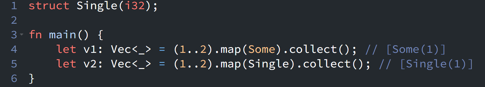

{fig-align="left" fig-alt="Rust Notes 5"}

When using the `map()` iterator adaptor, I usually expect to pass in a function or closure. I was already aware that we can pass a constructor such as `String::from()` directly, as shown in [Rust Notes #2](https://tech.ycwu.space/posts/rust-notes-2/20260509.html).

However, I recently discovered something interesting: when a function-like constructor takes a single argument—such as an enum variant or a tuple struct—it can also be passed directly to `map()`.

For example:

```rust
struct Single(i32);

fn main() {
    let v1: Vec<_> = (1..2).map(Some).collect(); // [Some(1)]
    let v2: Vec<_> = (1..2).map(Single).collect(); // [Single(1)]
}
```

In both cases, `Some` and `Single` act as constructor functions:

* `Some` has the type `i32 -> Option<i32>`
* `Single` has the type `i32 -> Single`

Because `map()` expects a function of the form `FnMut(Item) -> B`, these constructors can be used directly without writing an explicit closure like `|x| Some(x)` or `|x| Single(x)`.

This makes the code more concise when the transformation is a simple wrapping operation.

::: {.callout-warning}
# Disclaimer
This post was drafted by me, with AI assistance to refine the content.
::: 