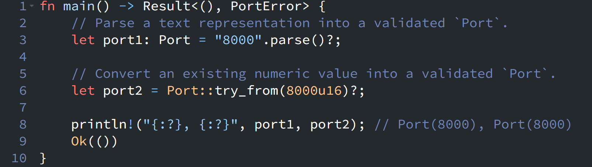

{fig-align="left" fig-alt="Rust Notes 6"}

Today I learned about the `FromStr` and `TryFrom` traits. At first glance, they seem very similar, but they represent different kinds of conversions.

According to the standard library documentation, [`FromStr`](https://doc.rust-lang.org/std/str/trait.FromStr.html) is used to **parse a value from a string**, while [`TryFrom`](https://doc.rust-lang.org/std/convert/trait.TryFrom.html) is for **fallible type conversions**—converting one type into another where the conversion may fail in a controlled way.

Another interesting point is that the convenient [`str::parse()`](https://doc.rust-lang.org/std/primitive.str.html#method.parse) method is implemented through the `FromStr` trait.

Here's a simple example:
```rust
use std::convert::TryFrom;
use std::str::FromStr;

#[derive(Debug)]
// A validated port number instead of a raw u16.
struct Port(u16);

#[derive(Debug)]
enum PortError {
    NotNumber,
    InvalidPort,
}

impl TryFrom<u16> for Port {
    type Error = PortError;

    fn try_from(value: u16) -> Result<Self, Self::Error> {
        // Validate domain-specific rules for a valid port.
        // For example, port 0 is reserved and not accepted here.
        if value == 0 {
            return Err(PortError::InvalidPort);
        }

        Ok(Self(value))
    }
}

impl FromStr for Port {
    type Err = PortError;

    fn from_str(s: &str) -> Result<Self, Self::Err> {
        // First parse the string representation into a numeric value.
        let value: u16 = s.parse().map_err(|_| PortError::NotNumber)?;

        // Delegate domain validation and construction to `TryFrom`.
        Self::try_from(value)
    }
}

fn main() -> Result<(), PortError> {
    // Parse a text representation into a validated `Port`.
    let port1: Port = "8000".parse()?;

    // Convert an existing numeric value into a validated `Port`.
    let port2 = Port::try_from(8000u16)?;

    println!("{:?}, {:?}", port1, port2); // Port(8000), Port(8000)

    Ok(())
}
```
In this example, the call to `parse()` in `main()` automatically uses the `FromStr` implementation for `Port`. Rather than implementing all the conversion logic itself, `from_str()` acts as a composition layer: it first parses the text representation into an intermediate value (`u16`), then delegates domain validation and construction to `TryFrom<u16>`.

This allows users to construct a validated `Port` from either text input (`"8000".parse()`) or an existing numeric value (`Port::try_from(8000u16)`), while keeping the validation logic centralized in one place.

::: {.callout-warning}
# Disclaimer
This post was drafted by me, with AI assistance to refine the content.
::: 