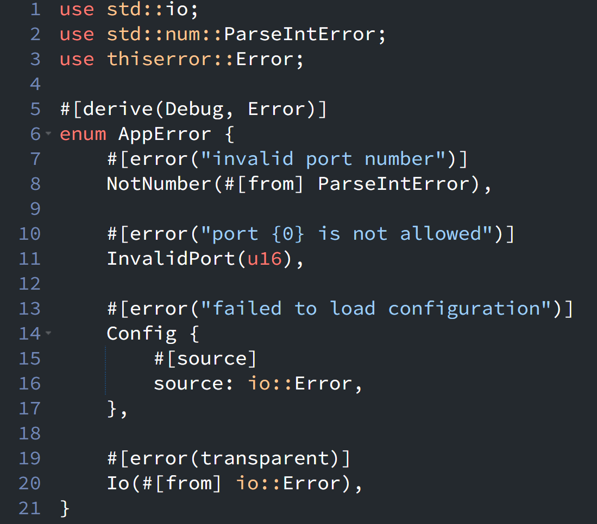

{fig-align="left" fig-alt="Rust Notes 7"}

[`thiserror`](https://docs.rs/thiserror/latest/thiserror/) provides a convenient way to remove repetitive boilerplate when implementing custom error types.

Under the hood, `thiserror` mainly generates implementations related to three standard Rust traits:

* `Display`
* `Error`
* `From`

The most commonly used attributes are:

| Attribute | Purpose | Rough equivalent |
|:---|:---|:---|
| `#[derive(Error)]` | Implements `std::error::Error` | `impl Error for MyError` |
| `#[error("...")]` | Defines the error message | `impl Display for MyError` |
| `#[from]` | Enables automatic error conversion with `?` | `impl From<T> for MyError` |
| `#[source]` | Marks the underlying cause of an error | `Error::source()` returning `Some(source)` |
| `#[error(transparent)]` | Wraps an error while preserving its representation | Forward `Display` and delegate representation to the underlying error |

For example:

## Using `thiserror`

```rust
use std::io;
use std::num::ParseIntError;
use thiserror::Error;

#[derive(Debug, Error)]
enum AppError {
    // #[from] provides From<ParseIntError> and establishes the source relationship.
    #[error("invalid port number")]
    NotNumber(#[from] ParseIntError),

    #[error("port {0} is not allowed")]
    InvalidPort(u16),

    // #[source] explicitly defines io::Error as the source.
    #[error("failed to load configuration")]
    Config {
        #[source]
        source: io::Error,
    },

    // #[error(transparent)] delegates representation to io::Error.
    // #[from] provides From<io::Error> and establishes the source relationship.
    #[error(transparent)]
    Io(#[from] io::Error),
}
```

## Roughly equivalent handwritten implementation

```rust
use std::error::Error;
use std::fmt;
use std::io;
use std::num::ParseIntError;

#[derive(Debug)]
enum AppError {
    NotNumber(ParseIntError),
    InvalidPort(u16),
    Config { source: io::Error },
    Io(io::Error),
}

// Equivalent to #[error("...")]
impl fmt::Display for AppError {
    fn fmt(&self, f: &mut fmt::Formatter<'_>) -> fmt::Result {
        match self {
            Self::NotNumber(_) => {
                write!(f, "invalid port number")
            }

            Self::InvalidPort(port) => {
                write!(f, "port {} is not allowed", port)
            }

            Self::Config { .. } => {
                write!(f, "failed to load configuration")
            }

            // Equivalent to #[error(transparent)]
            Self::Io(err) => err.fmt(f),
        }
    }
}

// Equivalent to the Error implementation generated by:
// #[derive(Error)] together with #[source] and #[from].
impl Error for AppError {
    fn source(&self) -> Option<&(dyn Error + 'static)> {
        match self {
            // #[from] implies #[source]
            Self::NotNumber(err) => Some(err),

            Self::InvalidPort(_) => None,

            // Explicit #[source]
            Self::Config { source } => Some(source),

            // #[from] implies #[source]
            // #[error(transparent)] delegates representation to the inner error.
            Self::Io(err) => Some(err),
        }
    }
}

// Generated by #[from] on the ParseIntError variant.
impl From<ParseIntError> for AppError {
    fn from(err: ParseIntError) -> Self {
        Self::NotNumber(err)
    }
}

// Generated by #[from] on the io::Error variant.
impl From<io::Error> for AppError {
    fn from(err: io::Error) -> Self {
        Self::Io(err)
    }
}
```

::: {.callout-warning}
# Disclaimer
This post was drafted by me, with AI assistance to refine the content.
::: 