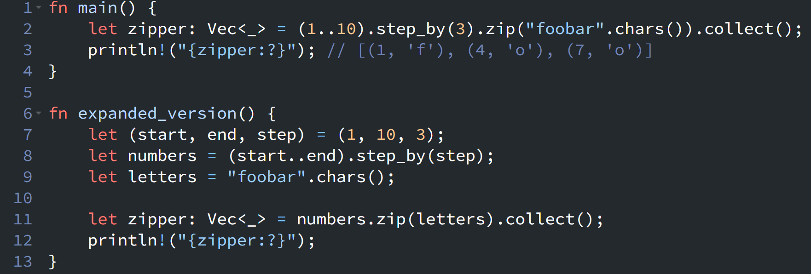

{fig-align="left" fig-alt="Rust Notes 8"}

Today, while reading the documentation for the [`Iterator`](https://doc.rust-lang.org/stable/std/iter/trait.Iterator.html) trait, I learned more about how iterator adaptors can be combined to create custom iteration patterns.

The standard [`enumerate()`](https://doc.rust-lang.org/stable/std/iter/trait.Iterator.html#method.enumerate) adaptor is a convenient way to add an index to each item in an iterator. However, Rust's iterator ecosystem provides many other adaptors that can be combined together to build more flexible iteration behaviors.

For example, by combining adaptors such as [step_by()](https://doc.rust-lang.org/stable/std/iter/trait.Iterator.html#method.step_by) and [zip()](https://doc.rust-lang.org/stable/std/iter/trait.Iterator.html#method.zip), we can create an iteration pattern that generates values with a specific start value, end value, and step size, then combines them with another iterator.
```rust
fn main() {
    let zipper: Vec<_> = (1..10).step_by(3).zip("foobar".chars()).collect();

    println!("{zipper:?}");
    // [(1, 'f'), (4, 'o'), (7, 'o')]
}
```

The iterator chain works as follows:

* `(1..10)` creates a range: `1, 2, 3, 4, ... 9`
* `.step_by(3)` keeps every third value: `1, 4, 7`
* `.zip("foobar".chars())` combines the numbers with the characters

For learning purposes, the same code can be expanded into smaller steps:
```rust
fn expanded_version() {
    let (start, end, step) = (1, 10, 3);

    let numbers = (start..end).step_by(step);
    let letters = "foobar".chars();

    let zipper: Vec<_> = numbers.zip(letters).collect();

    println!("{zipper:?}");
    // [(1, 'f'), (4, 'o'), (7, 'o')]
}
```

The expanded version makes each iterator easier to understand. Each iterator adaptor creates a new iterator, and the actual iteration only happens when `collect()` consumes the final `zip()` iterator.

::: {.callout-warning}
# Disclaimer
This post was drafted by me, with AI assistance to refine the content.
::: 