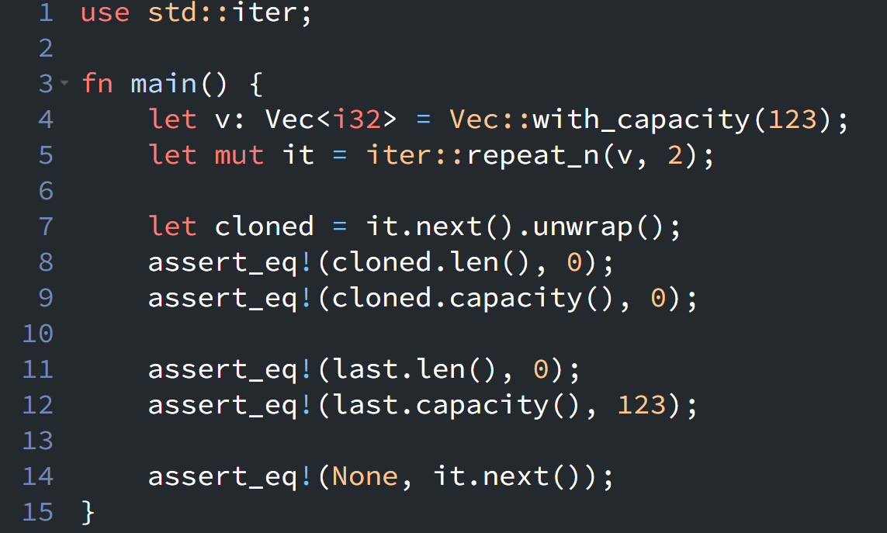

{fig-align="left" fig-alt="Rust Notes 9"}

I found an interesting detail while reading the documentation of [iter::repeat_n()](https://doc.rust-lang.org/stable/std/iter/fn.repeat_n.html).

Here's a simplified example from the docs:
```rust
use std::iter;

fn main() {
    let v: Vec<i32> = Vec::with_capacity(123);
    let mut it = iter::repeat_n(v, 2);

    // The first item is produced by cloning the stored value.
    // Note that Vec::clone() copies elements, not the spare capacity.
    let cloned = it.next().unwrap();
    assert_eq!(cloned.len(), 0);
    assert_eq!(cloned.capacity(), 0);

    // The final item is the original value moved out of the iterator.
    // This avoids an unnecessary clone.
    let last = it.next().unwrap();
    assert_eq!(last.len(), 0);
    assert_eq!(last.capacity(), 123);

    // No more items remain.
    assert_eq!(None, it.next());
}
```
`iter::repeat_n(v, 2)` takes ownership of `v`. In other words, `v` is moved into the iterator, and the iterator becomes responsible for producing the repeated values.

For the first `next()` call, `repeat_n()` clones the stored value using `Vec::clone()`. However, the cloned vector does not preserve the original vector's spare capacity. Since the original vector has a capacity of `123` but contains no elements, the cloned vector has a capacity of `0`.

The interesting part happens on the final `next()` call. Instead of cloning the value one more time, `repeat_n()` moves the original vector out of the iterator and returns it directly.

This means `repeat_n()` only needs to perform `n - 1` clones and can use the original value for the last item. It is a small but elegant optimization made possible by Rust's ownership system.

::: {.callout-warning}
# Disclaimer
This post was drafted by me, with AI assistance to refine the content.
::: 